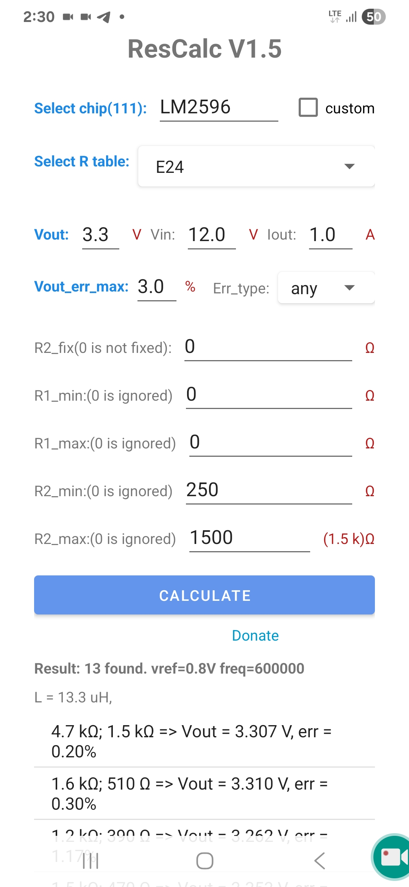
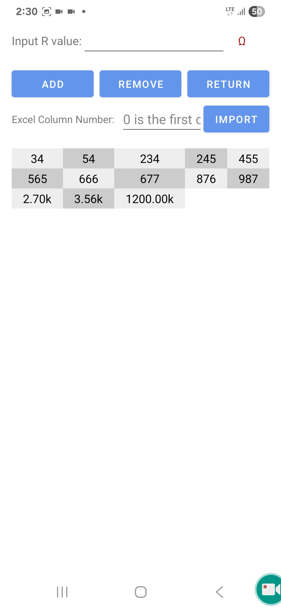

# ResCalc
This tool includes 111 popular power supply chips.and provides a wide range of customization options.You can choose from standard resistor series such as E24, E48, and E96, or import your own resistor library from Excel.If your chip is not listed, simply set the Vref to calculate.

https://github.com/EmbeddedChan/ResCalc/raw/main/apk/ResCalc15.apk

https://youtube.com/shorts/535lEd7Y3x4?si=hpZKqiEs-PUvKJFE

   

   
  <b>VoltCalcR1</b>  
   